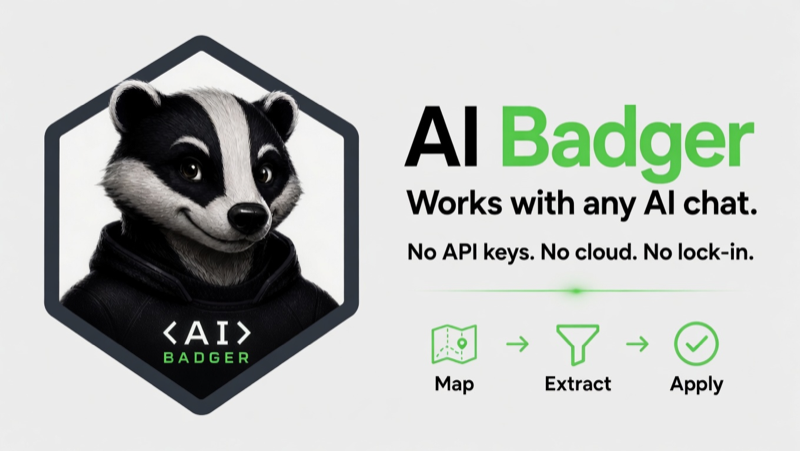

# AI Badger

AI Badger helps you use any AI chat with your local codebase without uploading your repository or requiring an AI provider API key.

It scans a project on your machine, maps the important project structure into a compact prompt, and helps you extract only the files or code spans your AI chat requests. You stay in control of what gets copied, reviewed, and written back.

It stays local by default: no telemetry, no file uploads, and no cloud service required to prepare code context.

No API keys. No cloud dependency. No vendor lock-in.

## Why AI Badger?

- **Works with any AI chat** — AI Badger prepares local code context for manual paste into ChatGPT, Claude, Gemini, or any other chat interface when you choose to use one.
- **Local-first by design** — normal use requires no API keys, no cloud service, no telemetry, and no network connection.
- **Precise context extraction** — AI can ask for `FILE:`, `PREFIX:`, or `NEAR:` references, and AI Badger extracts the relevant file or nearby logical code block instead of dumping the whole repository.

## Install

Install from the public Homebrew tap:

```bash
brew tap pvrlabs/aibadger
brew install pvrlabs/aibadger/badger
```

Or install the latest release with curl:

```bash
curl -fsSL https://raw.githubusercontent.com/PVRLabs/aibadger/main/install.sh | sh
```

For source builds, release builds, and version checks, see
[docs/install.md](docs/install.md).

## Quick start

1. **Goal** — Run `badger` in your project, type a goal like `Review this change for bugs`, paste a git diff, and press Enter.
2. **Map** — AIBadger scans your project and shows **Prompt 1: Topology** (project structure and files, not source code). Copy it and paste into any AI chat (Claude, ChatGPT, Gemini, etc.).
3. **Extract** — The AI asks for the files it needs. Copy its reply (e.g. `FILE:internal/scanner/scanner.go`) and paste it back into AIBadger. AIBadger prepares **Prompt 2: Code Context** with the relevant source.
4. **Analyze** — Copy Prompt 2 back to the AI chat. The AI reads the code and responds with analysis or code changes.
5. **Apply** — Paste the AI's final response into AIBadger, review the write plan, and confirm.

AIBadger works for code review, bug and performance analysis, code explanation, planning, and focused implementation requests. See [docs/usage.md](docs/usage.md) for a full walkthrough and more examples.

## Example tasks

1. Review a change before committing.
2. Find bugs or performance issues in a focused area.
3. Understand an unfamiliar part of a codebase.
4. Make a focused implementation request.

Example review goal:

```text
Review my current change for bugs.

[Paste git diff here]
```

For `.badger-context` and more examples, see [docs/usage.md](docs/usage.md).

## Context selectors

In step 3 of the workflow, paste extraction commands like these back into AIBadger to fetch only the files or code blocks the AI needs:

```text
FILE:internal/scanner/scanner.go
PREFIX:internal/scanner/scanner.go#func ScanProject(
NEAR:internal/scanner/scanner.go#detect project language
```

- `FILE:path` — extracts the entire file.
- `PREFIX:path#symbol` — extracts a declaration starting with that prefix (works for functions, types, methods, etc.).
- `NEAR:path#keyword` — extracts the code block around the first matching line.

## Privacy and safety

See [docs/privacy.md](docs/privacy.md).

## Supported projects

See [docs/usage.md](docs/usage.md) for the supported project model and
[docs/limitations.md](docs/limitations.md) for the current scan boundaries and
limits.

## Go package

The public facade is `github.com/PVRLabs/aibadger/pkg/badger`.

For contributor-facing notes, see [docs/development.md](docs/development.md).
