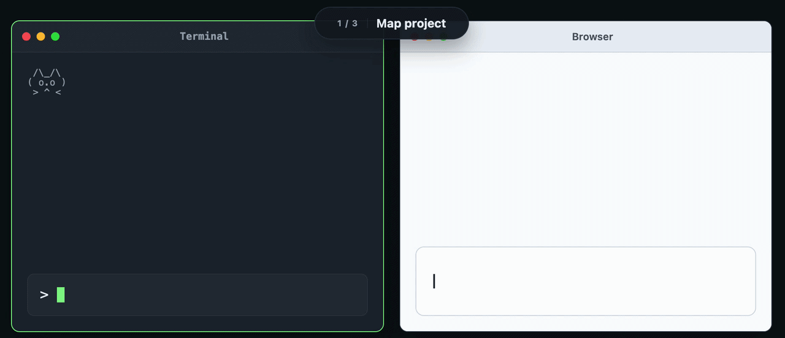

# AI Badger — Local AI Coding Context Tool

**Local-first codebase context extraction for any AI chat (Claude, ChatGPT, Grok, DeepSeek, etc.).**

Get **precise, token-efficient context** on demand without uploading your entire repo or wasting tokens on irrelevant files.

[](https://github.com/PVRLabs/aibadger/stargazers)
[](LICENSE)
[](go.mod)
[](https://github.com/PVRLabs/homebrew-tap)

**No cloud • No API keys • No telemetry • Fully local**

[▶ Try Interactive Demo](https://pvrlabs.xyz/aibadger/demo.html) • [Install](#install)

[](https://pvrlabs.xyz/aibadger/demo.html)

**Map → Extract → Apply:** Smart local context bridge that prepares focused codebase snippets for any LLM chat.

## How it works

**1. Map**  
Enter your goal. Badger builds a prompt.  
↳ You copy it → paste into your AI chat

**2. Extract**  
AI replies asking for specific files.  
↳ You copy that → paste back into Badger

**3. Apply**  
Badger fetches those files, builds a second prompt.  
↳ You copy it → paste into AI → review before writing

✓ Fully local — nothing leaves your machine until you copy it  
✓ You control every paste and every write

Perfect for **Claude token saving**, local LLM workflows, code reviews, design sessions, and debugging.

## Why AI Badger?

- **Universal compatibility** — Works with any AI chat interface or local model
- **Local-first codebase context tool** — Complete privacy, no uploads
- **Token efficient** — Stop burning agent tokens on reviews, explanations, or brainstorming
- **Precise & lightweight** — Built in Go, fast, minimal overhead
- **Specialized modes** — `review` and `design` for common workflows

## Install

### Homebrew (Recommended)
```bash
brew install pvrlabs/tap/badger
```

### Quick Curl Install
```bash
curl -fsSL https://raw.githubusercontent.com/PVRLabs/aibadger/main/install.sh | sh
```

See [docs/install.md](docs/install.md) for Windows, source builds, and more.

## Quick Start

1. Run `badger` in your project root.
2. Type your goal (or paste a git diff).
3. Copy **Prompt 1** → paste into your AI chat.
4. When the AI asks for files, copy its response → paste back into Badger.
5. Copy **Prompt 2** → paste back to the AI.
6. Paste the AI’s response into Badger → review and apply changes.

### Specialized Modes
- `badger review` — Git diff pre-loaded for code reviews
- `badger design` — Architecture and planning focus

Full usage: [docs/usage.md](docs/usage.md)

## Learn More

- [Usage Examples & Walkthrough](docs/usage.md)
- [API Reference](docs/api.md) — Non-interactive commands for editors and scripts
- [Articles](docs/articles/)
- [Protocol Reference](docs/protocol.md)
- [Limitations & Supported Projects](docs/limitations.md)
- [Privacy & Safety](docs/privacy.md)
- [Contributing](docs/development.md)

---

**Star if this local AI coding context tool solves a real pain for you ⭐**

Built with ❤️ by [PVR Labs](https://pvrlabs.xyz) — privacy-first developer tools.

[Website](https://pvrlabs.xyz/aibadger) • [X @kupolov](https://x.com/kupolov)
