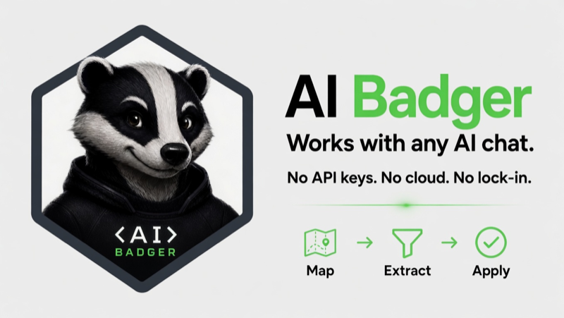
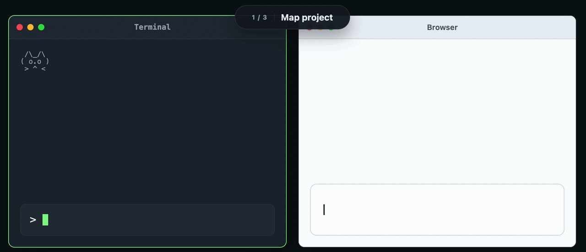

# AI Badger — Local AI Coding Context Tool

**Get a second opinion on your code changes using the AI chat you already use.**

Badger is a local-first repository-context bridge for reviews, design questions, and coding-agent workflows. It prepares focused context locally; you control what you share with your AI chat.

[](https://github.com/PVRLabs/aibadger/releases/latest)
[](LICENSE)
[](https://github.com/PVRLabs/homebrew-tap)
[](https://skills.sh/PVRLabs/aibadger)

**Local processing • No automatic uploads • No API keys • No telemetry**

[▶ Try Interactive Demo](https://pvrlabs.xyz/aibadger/demo.html) • [Install](#install)

[](https://pvrlabs.xyz/aibadger/demo.html)

## How it works

**1. Map**  
Enter your goal. Badger builds a prompt.  
↳ You copy it → paste into your AI chat

**2. Extract**  
AI replies asking for specific files.  
↳ You copy that → paste back into Badger

**3. Review and Apply**

Badger fetches those files and builds a second prompt.

↳ You copy it → paste into AI → review its response in Badger → confirm any writes

✓ Context is prepared locally — your AI provider receives what you paste

✓ You control every paste and every write

## Why AI Badger?

- **Universal compatibility** — Works with any AI chat interface or local model
- **User-controlled sharing** — Nothing is uploaded automatically
- **Token & cost efficient** — Send only relevant context instead of repeatedly feeding the whole repository to cloud models
- **Precise & lightweight** — Built in Go, fast, minimal overhead
- **Specialized modes** — `review` and `design` for common workflows

## Install

### Homebrew (Recommended)
```bash
brew install pvrlabs/tap/badger
```

### Quick Curl Install
```bash
curl -fsSL https://raw.githubusercontent.com/PVRLabs/aibadger/main/install.sh | sh
```

See [docs/install.md](docs/install.md) for Windows, source builds, and more.

Also available as an official [VS Code companion](https://marketplace.visualstudio.com/items?itemName=pvrlabs.ai-badger) ([GitHub](https://github.com/PVRLabs/aibadger-vscode)).

## Agent Skills

Badger includes the `handoff` and `badger-review` skills for continuing an AI
coding session or requesting an independent review. See the [Agent Skills
guide](skills/README.md) for installation, usage, and details.

## Quick Start

For an independent review of your Git changes:

- **VS Code:** With the optional [companion extension](https://marketplace.visualstudio.com/items?itemName=pvrlabs.ai-badger), open Source Control and choose **AI Badger: Copy All Changes for Review**, then paste the request into your AI chat. This direct review does not require the CLI.
- **CLI:** Run `badger review` in your project root, copy the prepared review request, and paste it into your AI chat.

For deeper repository or design questions, use Map → Extract:

1. Run `badger` in your project root. Interactive sessions start in Design focus.
2. Type your goal (or leave the editor empty and press Enter to explore the project).
3. Copy **Prompt 1** → paste into your AI chat.
4. When the AI asks for files, copy its response → paste back into Badger.
5. Copy **Prompt 2** → paste back to the AI.
6. Paste the AI’s response into Badger → review and apply changes.

### Specialized Modes
- `badger code` — explicitly start in Code focus
- `badger design` — explicitly start in Design focus with an empty editor

Full usage: [docs/usage.md](docs/usage.md)

## Learn More

- [Usage Examples & Walkthrough](docs/usage.md)
- [Browser Handoff Guide](docs/handoff.md)
- [Configuration: User limits and external context](docs/settings.md)
- [API Reference](docs/api.md) — Non-interactive commands for editors and scripts
- [Agent Integrations](docs/agents.md) — Compact repository orientation for coding agents
- [Limitations & Supported Projects](docs/limitations.md)
- [Privacy & Safety](docs/privacy.md)
- [Contributing](docs/development.md)

---

**If AI Badger makes your coding workflow simpler, consider starring the repo ⭐**
