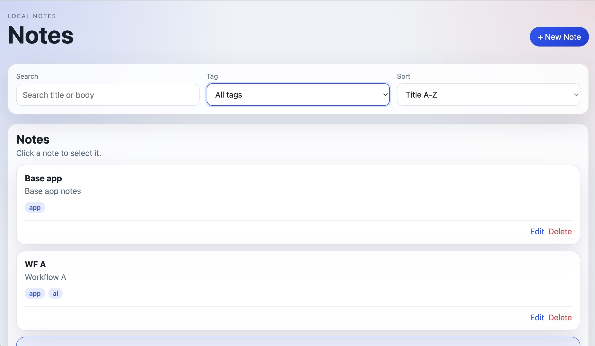
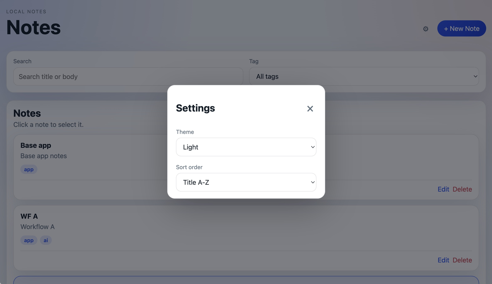
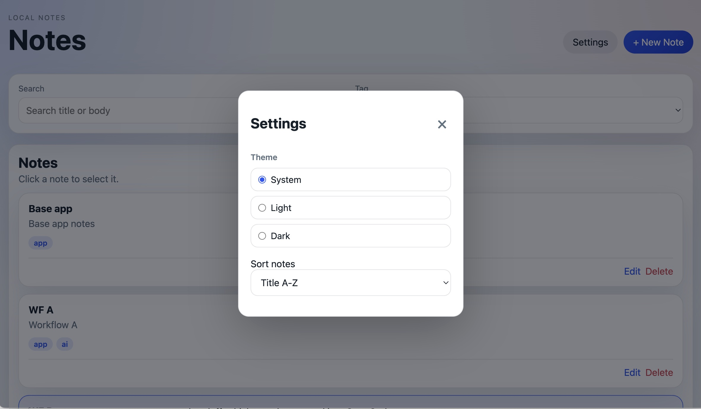

# Can AI Badger Reduce Local Coding Agent Token Usage?

In this single dogfooding experiment, using a compact handoff produced by AI Badger's `/design` mode plus an external compression step reduced OpenCode's active tokens by 32.1%, reasoning tokens by 85.6%, and runtime by 54.5% compared with sending the feature prompt directly.

Including cache reads, total token movement dropped by 63.2%.

Important caveat: this is directional evidence from one run per workflow. The implementations differed, and external-chat compression cost is not included.

## What this experiment measures

AI Badger's `/design` mode performed a local heuristic scan of the project; it made no LLM call. An external AI chat then compressed that context into a terse implementation handoff, which was passed to OpenCode.

The measurements below cover only the OpenCode execution sessions. They do not include the external compression step. There was one run per workflow, and `/plan` is a possible future direction rather than an existing Badger feature.

## The test app

The fixture is a small note-taking app built with no framework, no build system, and no dependencies.

I updated the underlying app so it better reflects the original requirements before running the comparison.

It has the usual local-app pieces: note creation, editing, deletion, search, tag filtering, sort order, settings persistence, and localStorage persistence. That makes it small enough to inspect but still rich enough to expose context-selection and handoff quality.

Both workflows produced working implementations of the requested settings feature and retained the core create, edit, delete, search, and filtering flows in manual review. The outputs differed in UI details and internal organization, and both had minor issues identified afterward. This experiment therefore compares execution efficiency, not equivalent final-code quality.

<figure>
  
  <figcaption>Base app before the feature</figcaption>
</figure>

The screenshot is left unedited. It frames the app clearly enough for this article, and the raw fixture snapshots remain the reproducible source of truth.

## The feature

Both workflows were asked to add the same settings panel:

```text
Add a settings panel to this existing note-taking app.

Requirements:
- Add theme setting: light, dark, or system.
- Add sort order setting: newest updated, oldest updated, title A-Z.
- Persist settings in localStorage.
- Apply settings on page load.
- Preserve existing note create/edit/delete/search behavior.
- Keep the app plain HTML/CSS/JS with no dependencies.
```

The original app requirements were broader, but the feature under test was intentionally narrow: add settings without disturbing the existing note workflow.

## Two workflows

Workflow A is direct OpenCode prompting with no Badger AI in the loop. Workflow B uses Badger Design plus a compact handoff.

### Workflow A: direct OpenCode prompt

OpenCode received the feature prompt directly.

<figure>
  
  <figcaption>Workflow A: Direct OpenCode</figcaption>
</figure>

Session:

```text
ses_0b324acf7ffeKNd3hIFbTD9d5v
```

Captured session data:

```text
input:              38,995
output:              8,359
reasoning:           9,151
cache_read:      1,137,664
cache_write:             0
active_total:       56,505
cache_total:     1,137,664
total_with_cache: 1,194,169
duration_ms:       207,401
```

### Workflow B: Badger Design + compact handoff + OpenCode

This workflow used Badger's existing `/design` output first, then an external AI chat step compressed that context into a terse local-agent handoff, which was then pasted into OpenCode.

The compression prompt was:

```text
Design the complete implementation, then produce a compact local-agent implementation plan with concrete changes only. Omit rationale, risks, open questions, acceptance criteria, and broad testing notes. Optimize the output for low token usage.
```

<figure>
  
  <figcaption>Workflow B: Badger Design + compact handoff</figcaption>
</figure>

Session:

```text
ses_0b30e208bffeJjWAhWtoHY7IEX
```

Captured session data:

```text
input:              30,143
output:              6,896
reasoning:           1,317
cache_read:        401,664
cache_write:             0
active_total:       38,356
cache_total:       401,664
total_with_cache:  440,020
duration_ms:        94,394
```

## Measurement approach

I compared the exported session data for the two OpenCode runs. That keeps the comparison tied to the exact local-agent sessions used in the experiment.

Active-token usage provides the cleaner primary comparison because cache-read accounting and pricing vary across models and providers. The comparison below measures only OpenCode execution. The Badger `/design` step is local and free of LLM cost. The external compression step is separate and typically much cheaper than local-agent reasoning tokens.

## Session-level results

| Metric           | Direct OpenCode | Badger Design + Handoff -> OpenCode | Change |
| ---------------- | --------------: | ----------------------------------: | -----: |
| Active total     |          56,505 |                             38,356 | -32.1% |
| Reasoning        |           9,151 |                              1,317 | -85.6% |
| Duration         |          207.4s |                              94.4s | -54.5% |
| Total with cache |       1,194,169 |                            440,020 | -63.2% |
| Input            |          38,995 |                             30,143 | -22.7% |
| Output           |           8,359 |                              6,896 | -17.5% |
| Cache read       |       1,137,664 |                            401,664 | -64.7% |

### Primary metrics

- Active total: -32.1%
- Reasoning: -85.6%
- Duration: -54.5%
- Total token movement, including cache: -63.2%

### Chart 1: total token movement

```text
Workflow A 1,194,169 | ##################################################
Workflow B   440,020 | ##################
Change: -63.2%
```

### Chart 2: active token breakdown

```text
Workflow A
  input     38,995 | #######################
  output     8,359 | #####
  reasoning  9,151 | #####

Workflow B
  input     30,143 | ##################
  output     6,896 | ####
  reasoning  1,317 | #
```

### Chart 3: cache read comparison

```text
Workflow A 1,137,664 | ##################################################
Workflow B   401,664 | #################
```

### Chart 4: duration comparison

```text
Workflow A  207.4s | ##################################################
Workflow B   94.4s | ######################
```

The headline result in this experiment is simple: the Badger Design + compact handoff workflow reduced OpenCode token movement by about 63% and runtime by about 55%.

On this run, Workflow B was the more token-efficient path.

Reasoning tokens dropped by about 86%, which is consistent with reduced agent-side exploration.

## What changed

The useful artifact was not a verbose implementation spec.

The useful artifact was a compact local-agent handoff:

- concrete file/function changes only
- no rationale
- no risks
- no open questions
- no acceptance criteria
- no broad testing notes

That is the shape I want a future Badger focus mode to automate.

## Why this is not the same as "chat writes the whole app"

For a tiny app, AI chat can sometimes generate the entire implementation without using a local coding agent at all, which is not the comparison here. That workflow can work well for small changes, but it does not scale cleanly to larger repositories. The more scalable path is the one used here: Badger exposes the relevant project context, external chat compresses it, and the local coding agent still performs the edit inside the repo.

## Product implication: automating the compact handoff

This experiment used Badger's existing `/design` workflow, not a dedicated plan mode.

That suggests a future Badger focus:

```text
/design  -> local topology/context summary for design discussion
/review  -> inspect code or changes
/plan    -> produce compact implementation handoff for a local coding agent
```

`/plan` is one possible name for a future mode that could automate this compact handoff. This article is a product-direction signal, not a claim that the feature already exists.

A future `/plan` mode could automate the compression step. But I do not want to rush it. The manual workflow has a safety valve: I can inspect the topology summary before asking for a compact handoff. An automated `/plan` mode would need enough confidence that the right context was found before handing instructions to a local agent.

The experiment therefore points to a sequence:

1. Ship the article.
2. Gather feedback.
3. See whether people want this workflow.
4. Improve confidence in Badger's design/topology scan.
5. Then consider implementing `/plan`.

## Caveats

- One app.
- One feature.
- One model.
- One local agent.
- No repeated runs yet.
- `summary.files` reported 0 in both exported sessions, so file-derived token metrics were ignored.
- Results may differ for trivial changes, very large changes, or tasks that require broad exploration.
- The compact handoff was produced in an external AI chat, not by Badger itself.
- Automating `/plan` too early could be risky if the topology scan misses key files.

The main claim stays narrow: in this experiment, a compact Badger-assisted implementation handoff reduced OpenCode token movement and runtime compared with prompting OpenCode directly.

## Supporting materials

The repository includes the experiment fixtures and the helper used to normalize the OpenCode session exports:

- [experiment prompts](./supporting-materials/prompts.md)
- [original base app](./supporting-materials/raw/note-app-base/index.html)
- [workflow A fixture](./supporting-materials/raw/note-app-workflow-a/index.html)
- [workflow B fixture](./supporting-materials/raw/note-app-workflow-b/index.html)
- [session usage helper](./supporting-materials/opencode-session-usage.py)

The `raw/` directories contain the exact fixture snapshots used for the measured OpenCode sessions. The screenshots are copied separately for article display. No `cleaned/` copy is needed for this writeup.

## Conclusion

This experiment does not prove that Badger always saves tokens.

It is consistent with something more useful:

A compact implementation handoff can reduce local-agent exploration. Badger Design is useful as a local context-generation step, but the final artifact passed to a local coding agent should be terse, concrete, and execution-oriented.

That is a reasonable reason to keep exploring a future `/plan` focus, after there is more confidence in the topology and context-selection heuristics.
