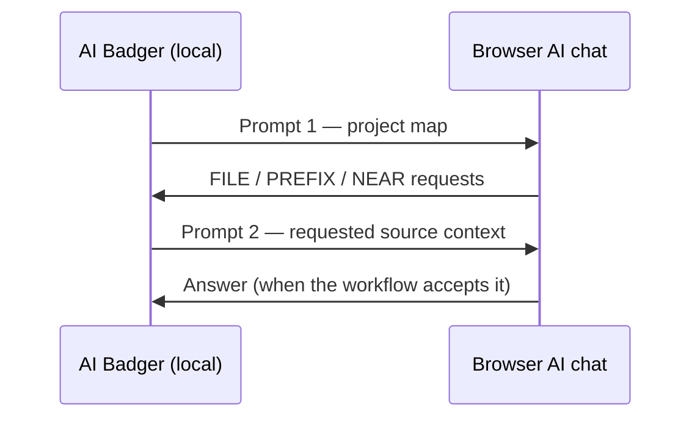

# Browser Handoff

AI Badger is a local bridge between your project and an AI chat in your
browser. Badger prepares focused context locally; you decide what to copy
between the two.

Badger does not connect to the AI service, upload your repository, or choose
files on the AI's behalf. The clipboard handoff keeps every transfer visible
and under your control.

> [!IMPORTANT]
> Your browser AI provider receives only what you explicitly paste. Prompt 2
> contains selected source context, so review the requested paths before
> copying it.

## Why Use a Manual Handoff?

- **You stay in control.** Nothing is sent automatically. You review and
  initiate every copy, paste, and file write.
- **It works with any AI chat.** The handoff uses plain text instead of a
  provider API, account integration, or API key.
- **Only focused context leaves the project.** The AI first sees a map, then
  asks for the specific files or spans it needs.
- **The boundary is easy to inspect.** Each clipboard payload is visible before
  you move it between Badger and the browser.

> [!NOTE]
> Badger needs no network access. It can scan and extract context in offline,
> air-gapped, or network-restricted development environments. Any transfer to
> an external AI remains a separate, explicit action and must follow your
> organization's policy.

## The Handoff at a Glance

1. Enter your question or task in Badger.
2. Copy the project map from Badger into a browser AI chat.
3. Copy the AI's file requests back into Badger.
4. Copy the requested file context from Badger into the same AI chat.
5. Bring the AI's answer back to Badger when your workflow supports reviewing
   or applying it.



> [!TIP]
> Keep the same browser conversation open. Prompt 2 adds source context to the
> project map and task already in that chat.

## Step 1: Send the Project Map

Badger scans the project locally and prepares **Prompt 1 (Map)**. It contains
your task and a compact view of the project structure, but it does not include
the full contents of your source files.

Copy Prompt 1 and paste it into your browser AI chat.

For example, an abbreviated Prompt 1 might look like this:

```text
[PROJECT TOPOLOGY]
Languages: Go
Stack: Go Modules
Structure: Single Module

[SOURCE TREE]
Pkg: . [3 files] -> Top: go.mod (1KB), README.md (4KB)
Pkg: internal/scanner [4 files] -> Top: scanner.go (8KB); Aux: scanner_test.go (12KB)

[TASK]
Explain how project scanning selects relevant files.

[CONSTRAINT]
Do not solve this yet. Reply only with FILE:, PREFIX:, or NEAR: selectors.
```

The generated prompt includes more detailed selection instructions, but the
essential contents are the project topology, your task, and the response
format the AI must use.

The AI uses the map to ask for specific context:

```text
FILE:README.md
PREFIX:internal/scanner/scanner.go#func (s *Scanner) Scan()
NEAR:go.mod#module
```

- `FILE:` asks for a file.
- `PREFIX:` asks for content beginning at a matching line.
- `NEAR:` asks for content around a matching line.

The exact paths and selectors depend on your question and project.

## Step 2: Send Only the Requested Files

Copy the AI's `FILE:`, `PREFIX:`, and `NEAR:` lines and paste them back into
Badger. Badger resolves those requests locally and prepares **Prompt 2 (Code
Context)**.

Prompt 2 contains the selected source context, so review the requested paths
before copying it. Then paste Prompt 2 into the same browser AI chat.

The AI now has:

- your original task;
- the project map; and
- the specific source context it requested.

It can answer with substantially more project-specific detail without
receiving the entire repository.

## Step 3: Review the Answer

Read the answer in the browser chat. In workflows that accept an AI response
back in Badger, paste it there to review proposed file changes before anything
is written.

Badger does not write files without an explicit confirmation.

## What Moves Between Badger and the Browser

| Direction | Contents |
| --- | --- |
| Badger → browser: Prompt 1 (Map) | Your task, file paths, and project structure |
| Browser → Badger: AI file requests | Selector lines naming the context the AI wants |
| Badger → browser: Prompt 2 (Code Context) | Source context selected by those requests |
| Browser → Badger: AI answer | Text you choose to paste back into Badger |

Nothing is sent automatically. Your browser AI provider receives only what you
explicitly paste.

For a complete command-line walkthrough, see [Usage](usage.md). For the prompt
formats, see the [Protocol Reference](protocol.md).
